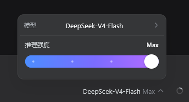
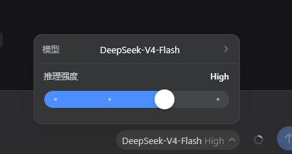

# DSH Effort Switcher

将 DSH 对话输入区原有的「模型 / 推理强度」选择入口替换为**推理强度滑动条**。滑块通过 DSH 官方 `modelDirectories` 服务提交当前模型的 `reasoningEffort`，设置会作用于后续请求。

## 屏幕截图






## 兼容性

- **官方 DSH**：`0.1.2-alpha.1`（当前最新 release）及其兼容实现，Web profile 与 CLI 均可运行。
- **DSH Desktop**：随应用锁定的上游即 `0.1.2-alpha.1`，本插件作为普通 Web Client bundle 安装进 Desktop profile 即可，无需任何 Desktop 专属改造。
- **组合方式**：只依赖官方 DSH contract —— `dsh.client` 客户端声明、`slots`（`conversation.input.model`）与 `slots` / `modelDirectories` / `sessions` 服务。不借用 `desktopRuntime`、`desktopPnpmBootstrap`、`desktopProfiles`、`desktopPnpm` 或任何 Electron API，因此**桌面壳、普通 Web 与 CLI 共用同一条兼容路径**。

## 要求

- Web profile 必须包含官方 `@deepseek-ai/dsh-web-app` bundle：它提供 `ui-conversation` 声明的 `conversation.input.model` slot 与 `ui-model-selection` 提供的 `modelDirectories` 服务。官方默认 web / desktop profile 均已包含；缺失时官方客户端启动会以 fail-loud 方式报告该插件行未激活。
- 当前模型必须暴露至少一个 reasoning effort 级别；无推理元数据的模型只显示模型选择入口，不显示滑块。

## 安装

Web profile：

```powershell
dsh plugin --profile web add github:SuShuheng/dsh-effort-switcher
```

DSH Desktop（托盘「Open DSH Terminal」，裸 `dsh` 默认作用于当前激活 profile）：

```powershell
dsh plugin add github:SuShuheng/dsh-effort-switcher
```

也可以显式指定：

```powershell
dsh plugin --profile desktop add github:SuShuheng/dsh-effort-switcher
```

命令会在 profile 的 `dsh.profile.bundles` 中追加本 bundle（因为包声明了 `dsh.bundle`），无需手改 `cordis.patch.yml`。

**安装来源建议：** git 安装拉取的是源码而非构建产物（本插件客户端包本身就是成品 bundle，无构建步骤）。建议锚定 commit，避免上游后续推送意外改变执行内容：

```powershell
dsh plugin --profile web add github:SuShuheng/dsh-effort-switcher#<commit-ish>
```

安装后必须**完全停止并重启** `dsh web`（或 DSH Desktop），再刷新/重新打开页面。DSH 只在 Host 进程启动时扫描 `dsh.client` 元数据；只刷新旧页面或运行独立开发服务器不会加载本插件。

## 卸载

```powershell
dsh plugin --profile web remove dsh-effort-switcher
dsh plugin remove dsh-effort-switcher   # DSH Desktop 终端
```

若 profile 的 `cordis.patch.yml` 中还残留旧的手工挂载（`id: effort-switcher`），先删除，避免双重挂载。卸载后同样需要重启。

## 验证安装

在 profile 目录中运行：

```powershell
node --input-type=module -e "const plugin=await import('dsh-effort-switcher'); console.log(plugin.name)"
```

预期输出：`effort-switcher`。

启动后选择一个支持 reasoning effort 的模型，对话输入区模型控件位置即显示「推理强度」滑块；拖动后 DSH 会重新提交当前模型与新的 `reasoningEffort`。

## 开发与自检

```powershell
npm run check   # 语法检查（index.js / host.js / verify-client.cjs）
npm test        # 无真实 DSH 的客户端行为验证（verify-client.cjs）
```

`npm test` 在 vm 中加载客户端 bundle，以最小 React shim 渲染 `EffortSliderSeat`，验证：官方客户端模块形状（`name`/`inject`/`apply`，无旧版 Config 平面）、以负数 priority 影子替换官方 seat（官方为 0）、注入 face 暴露 `available`/`directory`/`load`/`select`、两级菜单浮层、滑块拖拽/提交/换模型重置、失败选择保留菜单并显示错误、草稿含图片时的模型提示等。

从本地 checkout 链入 profile 进行迭代：

```powershell
dsh plugin --profile web add .
```

修改 `index.js` 后需重启 `dsh web` 并刷新页面。

## 项目结构

```text
index.js           Browser client module（closing-factory bundle）与滑动条 UI。
host.js            Host 入口：仅用于让 Loader 扫描本包并发现 dsh.client 声明。
cordis.patch.yml   Bundle patch：插入 host 插件行（id: effort-switcher）。
package.json       dsh.bundle 与 dsh.client 清单、exports 映射。
verify-client.cjs  无浏览器依赖的客户端行为自检脚本。
README.md          安装与合规说明。
.gitignore         本地开发排除项。
```

## 排障

- **滑块没有显示**：确认 profile 的 `dsh.profile.bundles` 中存在 `dsh-effort-switcher` 且包含官方 `@deepseek-ai/dsh-web-app`；完全重启 `dsh web` / DSH Desktop；选用支持 reasoning effort 的模型。
- **安装后页面未更新**：Web 启动图已经生成；停止旧进程后重新启动。
- **双重控件或重复挂载**：删除 profile `cordis.patch.yml` 里旧的 `effort-switcher` insert，只保留 bundle 层。
- **拖动后未生效**：检查模型是否支持多个 reasoning effort 级别；仅有默认强度的模型会隐藏滑块。
- **客户端启动报 `did not activate`**：说明 profile 缺少本插件声明的依赖包（如 `@deepseek-ai/dsh-client-ui-model-selection`），请确认 web-app bundle 与插件均已安装。

## 生态合规（DSH 插件生态倡议书）

- **组合优先**：通过官方 slot（`conversation.input.model`，由 `ui-conversation` 声明）与 service（`slots` / `modelDirectories` / `sessions`）组合能力，并借助 `slots.inject` 挂接官方声明生命周期；不 fork、不覆盖任何上游组件内部实现。
- **声明清晰**：`dsh.client.inject` 显式声明依赖的客户端包（ui-slots、ui-conversation、ui-model-selection）；客户端插件的 `inject` 显式声明所需服务。
- **兼容优先**：仅使用官方 DSH/Cordis 接口，不使用任何 Desktop 私有接口，升级到官方最新版本时无需改动组合方式。
- **插件市场上线后**，遵循上述约定的插件将更容易被发现、安装与信任（详见 [DSH 插件生态倡议书](https://github.com/anywhere-labs/dsh-desktop/blob/master/docs/plugin-ecosystem.md) 与 [插件开发](https://github.com/anywhere-labs/dsh-desktop/blob/master/docs/plugin-development.md)）。
