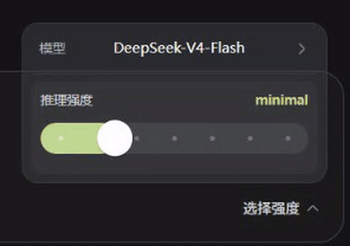
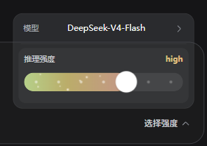

# DSH Thinking Effort Slide Bar

[](https://www.npmjs.com/package/dsh-thinking-effort-slide-bar)

npm 包：[dsh-thinking-effort-slide-bar](https://www.npmjs.com/package/dsh-thinking-effort-slide-bar)

为 **DeepSeek Harness 官方桌面版**提供思考强度滑动条：拖动选择档位，松手确认；随着强度提高，绿色轨道逐渐加入金色与粉色光效，星尘沿轨道流动。

## 可视化效果



GIF 使用本项目的实际前端组件录制，展示连续拖动、高档星尘与浅深主题切换。

| 状态 | 界面表现 |
| --- | --- |
| 收起 | 显示当前模型名称和已生效的思考档位。 |
| 展开 | 底部入口显示 **“选择强度”**；面板保留模型选择行、当前档位和滑动条。 |
| 拖动 | 旋钮与填充即时跟随指针，档位名称提示最近的位置。 |
| 松手 | 以 180 毫秒吸附到最近档位，只提交一次选择。 |
| 中高强度 | 绿—金—粉渐变逐渐增强，星尘最多 18 颗，流动速度随强度提高。 |
| 最高档 | 保留真实档位名称，并显示“使用更深更强的思考”。 |
| 减少动态效果 | 保留静态渐变与档位信息，停止星尘、扫光和位置过渡。 |

鼠标、触摸和触控笔均可拖动；键盘方向键逐档调整，Home / End 到达两端。可用档位来自当前模型，支持不同数量的档位；只有一个档位时仅展示，不播放动态光效。



## 安装到官方桌面版

### 安装 DeepSeek Harness

从 [DeepSeek 官方下载页](https://www.deepseek.com/download/) 下载适用于 Windows 或 macOS 的 **DeepSeek Harness 桌面端**，安装后先启动一次，完成初始化。可在应用菜单“关于 DeepSeek Harness”中查看版本。

本版本的适配目标为官方桌面端 **0.2.0-rc.2**。已完成该版本源码对照、实际模型目录代码的隔离验证与浏览器界面验收；这些验证不等同于在用户真实桌面会话中完成安装实测。

### 通过插件页面安装

1. 打开官方桌面端的“插件”页面，选择添加插件。
2. 输入本项目的 **npm 包名**：

   ```text
   dsh-thinking-effort-slide-bar
   ```

3. 安装完成后，完全退出并重新打开桌面端。
4. 点击输入框底部的模型入口，看到“选择强度”与滑动条后即可使用。

安装源可以选择“npm 官方源”或“中国大陆镜像源”。需要固定到本次发布版本时，填写 `dsh-thinking-effort-slide-bar@1.5.5`。这里不需要添加 GitHub 用户名前缀。

本项目的 [npm 页面](https://www.npmjs.com/package/dsh-thinking-effort-slide-bar) 提供已发布版本信息。也可从 [本项目 Releases](https://github.com/SuShuheng/dsh-thinking-effort-slide-bar/releases) 下载 `.tgz` 安装包，在插件页面选择本地安装；通过 GitHub 安装时使用 `github:SuShuheng/dsh-thinking-effort-slide-bar#v1.5.5`。

本地开发中的版本可以直接添加本项目所在的目录。安装后同样需要完全退出并重启桌面端。

### 使用桌面端自带的 dsh 命令

官方桌面端 `0.2.0-rc.2` 的应用菜单提供“管理 dsh 命令…”。从这里安装命令后，打开新终端运行 `dsh --version` 确认；无需另装 Node.js 或 pnpm。

先启动一次桌面端完成初始化，再**完全退出桌面端**，使用它自带的命令安装本项目：

```powershell
dsh plugin --profile desktop add dsh-thinking-effort-slide-bar@1.5.5
```

安装后重新打开桌面端。这里需要使用官方桌面端提供的 dsh 命令；单独通过 npm 安装的 dsh 不能管理官方 Desktop profile。

相关安装行为以 [官方桌面端说明](https://github.com/deepseek-ai/deepseek-harness/blob/dsh-v0.2.0-rc.2/apps/desktop/README.zh.md#终端命令) 为准。

## 本项目开发记录

本项目围绕输入区的模型选择与思考强度调整持续迭代：先完善档位排序和模型菜单，再增加最高档光效，随后将拖动和动画改为连续、渐进的反馈。

| 版本 | 本项目的改进 |
| --- | --- |
| 1.5.0 | 扩展思考强度词表，支持 off、minimal、low、medium、high、xhigh、max，以及模型声明的档位子集。 |
| 1.5.1 | 改善模型名称布局和悬浮说明，处理窄屏下说明框的位置。 |
| 1.5.2 | 将模型列表与强度滑条整合进同一个浮层，两个视图互相切换。 |
| 1.5.3 | 为最高可调档位加入绿—金—粉渐变和细小光点，并支持减少动态效果。 |
| 1.5.4 | 加入连续拖动、180 毫秒吸附、渐进星尘、档位文字颜色联动、失败回退与键盘焦点恢复。 |
| **1.5.5** | 展开时统一显示“选择强度”；正确处理官方新版的选择失败结果；适应新版附件 ID，避免把普通文件认定为图片；完整重写项目介绍、官方桌面端安装说明和动态预览。 |

当前开发检查覆盖展开与收起状态、不同档位数量、连续拖动与取消、提交失败和延迟确认、键盘焦点、浅深主题及减少动态效果。
