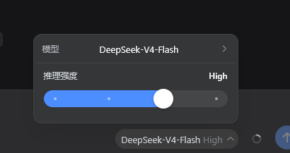

# DSH Effort Switcher

将 DSH 对话输入区原有的「模型 / 推理强度」选择入口替换为**推理强度滑动条**。滑块通过 DSH 官方 `modelDirectories` 服务提交当前模型的 `reasoningEffort`，设置会作用于后续请求。

## 屏幕截图




## 兼容性

- **官方 DSH**：`0.1.2-alpha.1`（当前最新 release）及其兼容实现，Web profile 与 CLI 均可运行。
- **DSH Desktop**：随应用锁定的上游即 `0.1.2-alpha.1`，本插件作为普通 Web Client bundle 安装进 Desktop profile 即可，无需任何 Desktop 专属改造。**已在 DSH Desktop（desktop profile）实测可用**；v1.5.4 延续相同的兼容路径。
- **组合方式**：只依赖官方 DSH contract —— `dsh.client` 客户端声明、`slots`（`conversation.input.model`）与 `slots` / `modelDirectories` / `sessions` / `remote` / `remote.session` 服务。不借用 `desktopRuntime`、`desktopPnpmBootstrap`、`desktopProfiles`、`desktopPnpm` 或任何 Electron API，因此**桌面壳、普通 Web 与 CLI 共用同一条兼容路径**。

## 要求

- Web profile 必须包含官方 `@deepseek-ai/dsh-web-app` bundle：它提供 `ui-conversation` 声明的 `conversation.input.model` slot 与 `ui-model-selection` 提供的 `modelDirectories` 服务。官方默认 web / desktop profile 均已包含；缺失时官方客户端启动会以 fail-loud 方式报告该插件行未激活。
- 当前模型如果没有 reasoning 元数据，会显示一个只读的 `off` 档；支持 reasoning 的模型则可通过滑块调整强度。

## 推理强度等级（settings.yaml 驱动）

约定：`reasoningEfforts` 写成 `{键名: 数值}`，其中**数值是固定词表** `off / minimal / low / medium / high / xhigh / max`（`off` 亦可写作 `none`，二者是同一「不思考」档的键/值两面），**键名是用户自定义标签**。插件一律**按数值（id）判定档位与顺序，不按键名**：

- **固定顺序**：`off/none（不思考） < minimal < low < medium < high < xhigh < max`。
- **前端显示名称固定为键名词汇**：`off / minimal / low / medium / high / xhigh / max`（`none` 值显示为 `off`；即使目录里的 `name` 是用户自定义键名，也按此固定名展示）。
- **任意组合**：以上 7 个数值的自由子集都能渲染为对应档数的滑块（2 档、3 档… 7 档），顺序始终按数值递增（pi-ai 官方递增序），与写入顺序无关。
- **单档模式**：不支持推理调整的模型（无 reasoning 元数据 / `reasoningEfforts: false`）渲染**单个固定 `off` 档**（默认 = off，值为 none；只读、不提交）；只声明了唯一档位的模型同样显示一个只读位置。

示例 `$DSH_HOME/settings.yaml`（`llm-pi-ai` 自定义网关，7 档含 off）：

```yaml
llm-pi-ai:
  providers:
    my-gateway:
      api: openai-completions
      baseURL: https://gateway.example/v1
      apiKeyEnv: GATEWAY_API_KEY
      reasoning: high                  # 可选：该路由的默认推理强度
      models:
        - id: DeepSeek-V4-Flash
          name: DeepSeek-V4-Flash
          reasoningEfforts:
            off: none                  # 键名 off（前端显示固定名），数值 none（不思考）
            minimal: minimal           # minimal:minimal —— 键值相同也可
            low: low                   # 键名可为任意标签，数值决定档位
            medium: medium
            high: high
            xhigh: xhigh
            max: max
```

也支持任意子集，例如只声明两档：

```yaml
          reasoningEfforts:
            off: none                  # 键名可自定义，例如 off/关闭/停止 → 值 none
            max: max                   # 值 max 决定这是最右一档
```

行为约定：

- 滑块档位 = 该模型声明的档位；拖动后提交 `reasoningEffort` = 档位**数值**（如 `off`、`minimal`、`xhigh`、`max`），由 Host 校验并作用于后续请求。
- 单档 `off`（值 none）：只读展示，不向 Host 提交任何 effort 变更。
- 鼠标、触摸与触控笔拖动时，旋钮和填充连续跟随指针；松手后以 180ms 吸附最近档位并提交一次。指针移出轨道后仍可松手；取消拖动会恢复已生效档位。方向键和 Home/End 保留原生键盘操作，提交完成后恢复因禁用而丢失的滑条焦点。
- 配色保留绿色、金色与粉色。按当前模型的相对位置逐渐增强光效：前 1/3 保持绿色，之后淡入背景光效、扫光和横向星尘；星尘从 0 增至 18 颗，穿行时间随强度由约 6s 缩短至 2.4s（个体差异 ±4%）。星尘与背景独立分层，固定分布和初始进度，变速保留当前动画进度。
- 当前模型的最高可调档位仍显示档位名称，同时提示「使用更深更强的思考」。最高档按模型实际声明的档位判断，无需命名为 `max`；例如只有 low/medium 两档的模型，medium 为最高档。
- 展开面板的档位名称和轨道配色联动；收起按钮只按宿主已确认的档位着色，Off 保持主题灰色。浅色主题使用深色文字，深色主题使用亮色文字，避免直接将浅色轨道颜色用于文字。
- 提交期间保持目标位置并暂时禁用重复操作；宿主拒绝时回退真实档位并显示原因。单档只读模式不播放动画；面板关闭或切到模型列表时动画元素卸载。系统开启减少动态效果时禁用星尘、扫光和位置过渡，保留静态渐变和焦点提示。
- 修改 `settings.yaml` 后 Host 目录会在 `settings/document-updated` 事件时刷新，重新打开面板即可看到新档位，无需重启 `dsh web`。
- 插件不直接解析 `settings.yaml`：成品目录由 Host 权威解析，滑块只消费 `reasoning.efforts`（`id`=数值、`name`=用户键名），与官方 `/model` 弹窗及 Host 校验保持一致。

## 安装

### 方式一：GitHub Release 标签（推荐，锚定版本）

Web profile：

```powershell
dsh plugin --profile web add github:SuShuheng/dsh-thinking-effort-slide-bar#v1.5.4
```

DSH Desktop（托盘「Open DSH Terminal」，裸 `dsh` 默认作用于当前激活 profile）：

```powershell
dsh plugin add github:SuShuheng/dsh-thinking-effort-slide-bar#v1.5.4
```

也可以显式指定 desktop profile：

```powershell
dsh plugin --profile desktop add github:SuShuheng/dsh-thinking-effort-slide-bar#v1.5.4
```

### 方式二：tarball 安装（无构建步骤，无需 allowBuilds 白名单）

直接安装 Release 资产（推荐）：

```powershell
dsh plugin --profile web add https://github.com/SuShuheng/dsh-thinking-effort-slide-bar/releases/download/v1.5.4/dsh-thinking-effort-slide-bar-1.5.4.tgz
dsh plugin --profile desktop add https://github.com/SuShuheng/dsh-thinking-effort-slide-bar/releases/download/v1.5.4/dsh-thinking-effort-slide-bar-1.5.4.tgz
```

也可以从 [Releases](https://github.com/SuShuheng/dsh-thinking-effort-slide-bar/releases) 页面下载 `dsh-thinking-effort-slide-bar-1.5.4.tgz`（或 `npm pack` 自行打包）后本地安装：

```powershell
dsh plugin --profile web add ./dsh-thinking-effort-slide-bar-1.5.4.tgz
dsh plugin --profile desktop add ./dsh-thinking-effort-slide-bar-1.5.4.tgz
```

### 方式三：直接锚定 commit（跟随最新源码）

```powershell
dsh plugin --profile web add github:SuShuheng/dsh-thinking-effort-slide-bar#<commit-ish>
```

无论哪种方式，命令都会在 profile 的 `dsh.profile.bundles` 中追加本 bundle（因为包声明了 `dsh.bundle`），无需手改 `cordis.patch.yml`。git/tarball 安装本插件**没有** `prepare` 构建（客户端包就是成品 bundle），一般不需要 `allowBuilds` 白名单。

安装后必须**完全停止并重启** `dsh web`（或 DSH Desktop），再刷新/重新打开页面。DSH 只在 Host 进程启动时扫描 `dsh.client` 元数据；只刷新旧页面或运行独立开发服务器不会加载本插件。

## 卸载

```powershell
dsh plugin --profile web remove dsh-thinking-effort-slide-bar
dsh plugin remove dsh-thinking-effort-slide-bar   # DSH Desktop 终端
```

若 profile 的 `cordis.patch.yml` 中还残留旧的手工挂载（`id: effort-switcher`），先删除，避免双重挂载。**从 v1.3.2 及更早版本升级的用户**：旧包名 `dsh-effort-switcher` 与新版是不同 bundle，请先 `dsh plugin remove dsh-effort-switcher` 再安装新版，避免两个 bundle 并存。卸载后同样需要重启。

## 验证安装

在 profile 目录中运行：

```powershell
node --input-type=module -e "const plugin=await import('dsh-thinking-effort-slide-bar'); console.log(plugin.name)"
```

预期输出：`thinking-effort-slide-bar`。

启动后选择一个支持 reasoning effort 的模型，对话输入区模型控件位置即显示「推理强度」滑块；拖动后 DSH 会重新提交当前模型与新的 `reasoningEffort`。

## 开发与自检

```powershell
npm run check   # 语法检查（index.js / host.js / verify-client.cjs）
npm test        # 无真实 DSH 的客户端行为验证（verify-client.cjs）
```

`npm test` 在 vm 中加载客户端 bundle，以最小 React shim 渲染 `EffortSliderSeat`，验证：官方客户端模块形状（`name`/`inject`/`apply`，无旧版 Config 平面）、以负数 priority 影子替换官方 seat（官方为 0）、注入 face 暴露 `available`/`directory`/`load`/`select`、从输入区上方出现的单一浮层及其模型/强度互斥视图、连续指针位置/松手吸附/单次提交/取消及丢失指针捕获、提交失败回退与延迟确认、键盘焦点恢复且不抢占其他控件、换模型及关闭面板重置、渐进星尘数量/变速保持进度/最高档名称（包括最高档为 `medium` 的模型）、单档只读及锁定模式、失败模型选择保留菜单并显示错误、草稿含图片时的模型提示等。

从本地 checkout 链入 profile 进行迭代：

```powershell
dsh plugin --profile web add .
```

修改 `index.js` 后需重启 `dsh web` 并刷新页面。

## 项目结构

```text
index.js           Browser client module（closing-factory bundle）与滑动条 UI。
host.js            Host 入口：仅用于让 Loader 扫描本包并发现 dsh.client 声明。
cordis.patch.yml   Bundle patch：插入 host 插件行（id: thinking-effort-slide-bar）。
package.json       dsh.bundle 与 dsh.client 清单、exports 映射。
verify-client.cjs  无浏览器依赖的客户端行为自检脚本。
README.md          安装与合规说明。
.gitignore         本地开发排除项。
```

## 排障

- **滑块没有显示**：确认 profile 的 `dsh.profile.bundles` 中存在 `dsh-thinking-effort-slide-bar` 且包含官方 `@deepseek-ai/dsh-web-app`；完全重启 `dsh web` / DSH Desktop；选用支持 reasoning effort 的模型。
- **安装后页面未更新**：Web 启动图已经生成；停止旧进程后重新启动。
- **双重控件或重复挂载**：删除 profile `cordis.patch.yml` 里旧的 `effort-switcher` insert，只保留 bundle 层（v1.5.0 起为 `thinking-effort-slide-bar`）。
- **拖动后未生效**：确认模型在目录中暴露了 reasoning 元数据（settings.yaml 声明了 `reasoningEfforts`）；无元数据模型只显示单档 `off`（只读），无法拖动。
- **客户端启动报 `did not activate`**：说明 profile 缺少本插件声明的依赖包（如 `@deepseek-ai/dsh-client-ui-model-selection`），请确认 web-app bundle 与插件均已安装。

### 已安装但仍显示官方模型入口（未出现滑块）

「安装成功」不等于「客户端已生效」：bundle 行进入 Host 组合后，Web Client 启动图还要发现并激活客户端包，我们的 seat 才能在 slot 里胜出。**已知根因之一已在 v1.3.2 修复**（插件客户端缺少 `remote` / `remote.session` 注入，`modelDirectories.directoryFor` 抛 `cannot get property "remote.session" without inject` 后被渲染器隔离、回退官方 seat）——请先安装最新版（v1.5.4，包名 `dsh-thinking-effort-slide-bar`），再按顺序排查：

1. **完全重启 DSH Desktop**（托盘「退出」而非关窗；Windows 下确认没有残留 `dsh-desktop` 进程），再重新打开窗口并 **Ctrl+Shift+R 硬刷新**。插件必须在 Host 启动时进入 Loader 组合，仅刷新页面不会加载。
2. 打开页面 DevTools Console（F12），搜索：
   - `[thinking-effort-slide-bar] client activated` 与 `[thinking-effort-slide-bar] seat registered` —— 有这两行说明客户端已加载并注册（优先级 -100 应胜出）。
   - `slot entry crashed in 'conversation.input.model':` 或 `[thinking-effort-slide-bar] inject failed for session` —— 说明我们的 seat 触发后被渲染器隔离、回退到官方 seat（这是设计内的兜底），**把该行完整报错发给我们**即可定位。
   - 一行都没有 —— 客户端包没进启动图：页面源码（Ctrl+U）搜索 `dsh-thinking-effort-slide-bar`；或在桌面终端运行 `dsh --profile desktop --dump-config`，确认存在 `== dsh-thinking-effort-slide-bar` 层。
3. 若控制台显示激活成功且无崩溃，但仍显示官方入口：确认所用 profile 正确（`dsh --profile desktop --dump-config` 中该层的 `id: thinking-effort-slide-bar` 覆盖了官方 `ui-model-selection` 行且无重复插入）。

## 生态合规（DSH 插件生态倡议书）

- **组合优先**：通过官方 slot（`conversation.input.model`，由 `ui-conversation` 声明）与 service（`slots` / `modelDirectories` / `sessions` / `remote` / `remote.session`）组合能力，并借助 `slots.inject` 挂接官方声明生命周期；不 fork、不覆盖任何上游组件内部实现。
- **声明清晰**：`dsh.client.inject` 显式声明依赖的客户端包（`@deepseek-ai/dsh-api-remotes`、ui-conversation、ui-model-selection）；客户端插件的 `inject` 显式声明所需服务（与官方 ui-model-selection 一致）。
- **兼容优先**：仅使用官方 DSH/Cordis 接口，不使用任何 Desktop 私有接口，升级到官方最新版本时无需改动组合方式。
- **插件市场上线后**，遵循上述约定的插件将更容易被发现、安装与信任（详见 [DSH 插件生态倡议书](https://github.com/anywhere-labs/dsh-desktop/blob/master/docs/plugin-ecosystem.md) 与 [插件开发](https://github.com/anywhere-labs/dsh-desktop/blob/master/docs/plugin-development.md)）。

## 更新日志

- **v1.5.4**：升级连续拖动与渐进暖色光效。鼠标、触摸与触控笔拖动即时跟手，松手以 180ms 吸附并单次提交；绿—金—粉渐变、扫光与最多 18 颗横向星尘独立分层，变速保持动画进度。最高档名称保持可见，档位文字按主题着色，收起按钮仅显示宿主已确认档位。补齐取消拖动、失败回退、延迟确认、旧请求隔离、Off/none 去重及键盘焦点恢复；减少动态效果时保留静态渐变，恢复时同步粒子速率。语法与行为验证及隔离预览的 26 项 Chromium 验收通过（实际宿主安装未在本轮验证）。
- **v1.5.3**：参考 Codex 录屏，为当前模型的最高可调思考档位增加绿色、金色与粉色流动渐变及细小漂移闪烁光点；最高档提示改为「使用更深更强的思考」。按模型声明的最高档触发，无需档位命名为 `max`；离开最高档恢复普通轨道，单档只读模式不播放动画。支持系统减少动态效果设置，并补充滑块档位的无障碍文本与最高档行为自检。
- **v1.5.2**：修复模型说明框贴近窗口边缘时的溢出；模型列表改为与推理强度滑块互斥的同一上浮面板视图；滑块面板改用参考图的紧凑圆角深色样式与鼠尾草绿色轨道，并补充当前模型勾选状态。
- **v1.5.1**：优化模型选择浮层与模型列表布局。二级模型菜单与主菜单统一对齐；模型名称不再被同一行的说明文本挤压；模型说明改为悬浮注释框，并支持键盘聚焦和窄屏自动换侧。
- **v1.5.0**：档位词汇表扩展为 7 档 —— `off / minimal / low / medium / high / xhigh / max`（新增 `minimal` 与 `xhigh`，对应 `minimal:minimal` / `xhigh:xhigh` 键值对；`off`≡`none` 仍为最左「不思考」档）。排序、显示名、任意子集（2..7 档）与自检全部按新词汇表。
- **v1.4.0**：仓库与包名同步改名为 `dsh-thinking-effort-slide-bar`（Loader 行 id / 模块名 / 控制台标签 / 安装卸载命令 / tarball 名全部同步）；安装命令改为 `github:SuShuheng/dsh-thinking-effort-slide-bar#v1.5.0`。**升级自 v1.3.2 及更早版本**：旧包名 `dsh-effort-switcher` 与新包名是不同 bundle，请先 `dsh plugin remove dsh-effort-switcher` 再安装新版，避免两个 bundle 并存。
- **v1.3.2**：修复 seat 被渲染器隔离回退（官方入口兜底显示）的根因——客户端 inject 补齐与官方一致的 `remote` / `remote.session`（`ModelDirectoryResolver` 按调用方上下文访问 `ctx.remote.session`）；`dsh.client.inject` 增加 `@deepseek-ai/dsh-api-remotes` 依赖边。已在 DSH Desktop 实测可用。
- **v1.3.1**：新增激活/注册/故障诊断日志；`inject` face 异常显式报错后重抛（触发渲染器隔离并回退官方入口，便于定位）；移除指向平台模块的无效依赖边。
- **v1.3.0**：档位一律按数值（`id`）判定与排序（`none/off < low < medium < high < max`，`off`≡`none` 为最左「不思考」档）；任意子集 2/3/4/5 档自适应；无 reasoning 元数据模型显示单档 `off`（默认=off、值 none，只读）；前端显示名称固定为键名词汇 `off/low/medium/high/max`。
- **v1.2.0**：滑块效果对齐参考图（触发器 `模型名 档位名` 空格分隔）；档位完全由 settings.yaml 的 `reasoningEfforts` 驱动（任意档数）。
- **v1.1.0**：兼容官方最新 DSH 规范与 DSH Desktop 插件规范（移除旧 `~standard` Config、规范 host 入口、显式依赖声明、Desktop 安装指引）。
